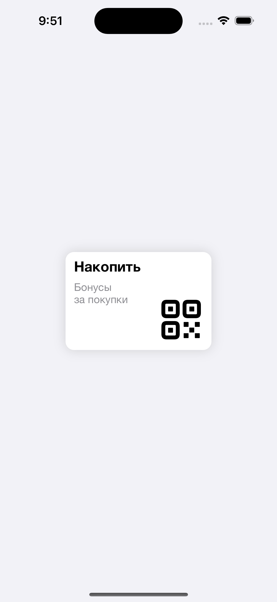
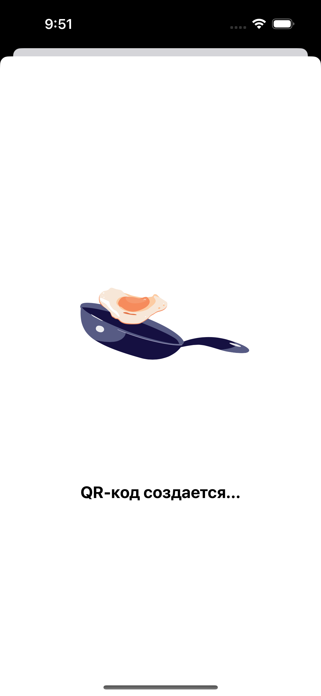
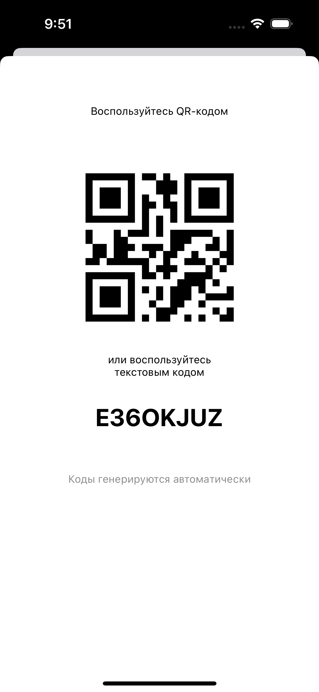

# Bonus Program app for IOS

App implements generating code for bonus program.

  
  
  

# Features
- Loading placeholder with random animation
- Usage API for generating codes
- QR code generation

# Usage
 - confugure `API-Keys.plist` file in Resources folder with API key from [random.org](https://www.random.org), plist key is `GENERATOR_API_KEY`

# Dependencies
- Lottie

# Acknowledgement
- Animated illustrations from [creattie.com](https://creattie.com)